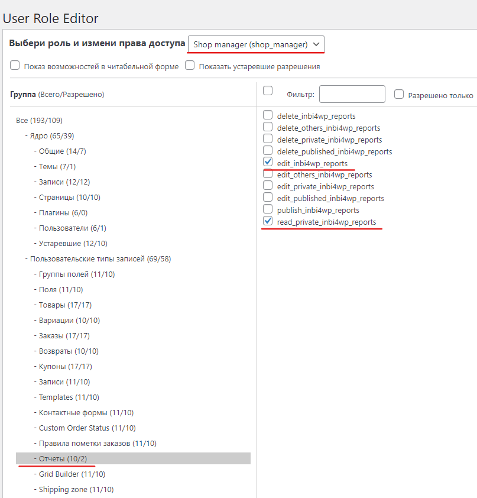

IN BI For WP: Google Data Studio Reports For WordPress
======================================================

Добавляет любые Google Data Studio отчеты в WordPress
-----------------------------------------------------

Плагин INBI4WP позволяет размещать любые BI отчеты в админке WordPress
Источником отчетов может служить любая BI система, позволяющая генерировать встраиваемые отчеты, например:
* Google Data Studio
* Microsoft Power BI

В настоящем документе собраны технические сведения о разработке плагина. Описание плагина и его работы доступно на сайте:
* [https://ivannikitin-com.github.io/inbi4wp/](https://ivannikitin-com.github.io/inbi4wp/)

Права доступа к отчетам
-----------------------

Администраторы имеют полные права. Любым другим ролям необходимо явно назначить разрешения
на операции с отчетами, например, с помощью плагина [User Role Editor](https://wordpress.org/plugins/user-role-editor/).

Например, разрешим менеджерам магазина просматривать отчеты:

История изменений
-----------------
* 21.01.2023    Коррекция прав доступа к отчетам
* 02.05.2019	Готов основной функционал плагина.

